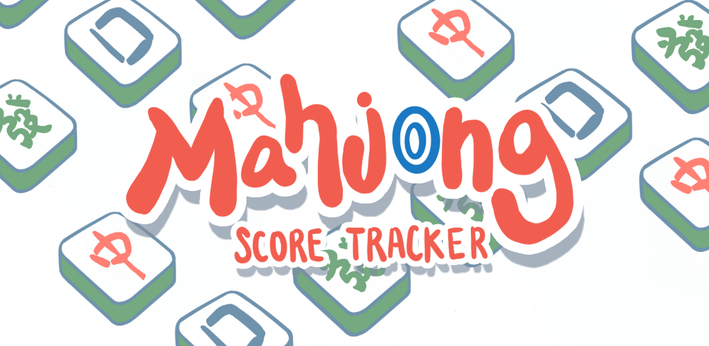

# Mahjong Tile Detection Training



<div align="center">

Portfolio project code for training the computer vision model behind an auto-calculate Mahjong feature.

[](https://github.com/ultralytics/ultralytics)
[](#dataset-coverage)
[](#training-workflow)

</div>

## Overview

This repository contains the training workflow for a Mahjong tile detection model used in the **auto-calculate** feature of **Mahjong Score Tracker**. Its role is to identify Mahjong tiles from images so a downstream scoring or hand-analysis system can understand what tiles are present.

The training pipeline is built around **YOLOv8** and includes dataset preparation, validation, training, evaluation, and export steps for mobile-friendly inference formats.

## Why This Project

Mahjong tile recognition is challenging because tile sets vary across regions, tile artwork differs by manufacturer, and some variants include additional tiles or visual differences. This project focuses on building a detector that is practical for real-world play scenarios, especially for portfolio-worthy product features such as:

- automatic tile detection from photos
- auto-calculate hand input assistance
- mobile-ready on-device inference
- support for multiple Mahjong rulesets and tile styles

## Supported Tile Coverage

The model is designed to cover tiles used across:

- **Hong Kong Mahjong**
- **Chinese Mahjong**
- **Taiwanese Mahjong**
- **Japanese Mahjong (Riichi)**

The dataset currently contains **47 classes**, including:

- the three numbered suits: `man`, `tong`, and `sok`
- honor tiles: winds and dragons
- flower and season tiles
- Japanese red-five variants
- face-down tile backs

## Dataset Coverage

### Suits

- `1man` to `9man`
- `1tong` to `9tong`
- `1sok` to `9sok`
- `5man-richi`, `5tong-richi`, `5sok-richi`

### Honor Tiles

- Winds: `ew`, `sw`, `ww`, `nw`
- Dragons: `rd`, `gd`, `wd-blank`, `wd-box`

### Bonus / Special

- Flowers: `1flower` to `4flower`
- Seasons: `1season` to `4season`
- Face-down tile: `back`

## Training Workflow

The main training notebook/script is `kaggle_yolov8_workflow.py`. It is structured to support a Kaggle-based workflow and covers the full model lifecycle:

1. point the training config at the dataset location
2. rewrite `data.yaml` with runtime-safe paths
3. run a preflight dataset check
4. train a YOLOv8 model
5. validate the best checkpoint
6. export production-friendly model formats
7. run a smoke-test prediction

Current export targets:

- `ONNX` for cross-platform inference
- `TFLite` for Android/mobile usage
- `CoreML` for iOS deployment

## Repository Structure

```text
.
├── kaggle_yolov8_workflow.py      # End-to-end Kaggle training workflow
├── download-roboflow-dataset.py   # Dataset download helper
├── dataset/
│   ├── data.yaml                  # YOLO dataset configuration
│   └── _roboflow_download/        # Source export from Roboflow
└── README.md
```

## Data Refresh

To refresh the dataset from Roboflow:

1. add `ROBOFLOW_API_KEY=...` to `.env`
2. install the dependency: `pip install roboflow`
3. update `download-roboflow-dataset.py` if workspace/project/version changes
4. run `python download-roboflow-dataset.py`
5. copy `train/`, `valid/`, `test/`, and `data.yaml` into `dataset/`
6. verify the dataset before training

## Portfolio Notes

This repository is the **model training side** of a larger product capability in **Mahjong Score Tracker**. The goal is not just academic object detection, but enabling a usable auto-calculate experience where tile detection becomes the vision layer feeding game logic and score calculation.

From a portfolio perspective, this project demonstrates:

- applied computer vision for a niche domain
- multi-variant dataset design across regional Mahjong systems
- deployment-aware model export for mobile apps
- practical ML workflow design from data ingestion to inference artifacts

## Tech Stack

- Python
- Ultralytics YOLOv8
- Roboflow dataset exports
- Kaggle training environment
- ONNX / TFLite / CoreML export pipeline

## Future Improvements

- expand dataset diversity across lighting conditions and camera angles
- benchmark accuracy across different Mahjong tile manufacturers
- add quantitative metrics and sample predictions to the README
- integrate the exported models directly into the production app pipeline

## License

This repository is presented as a portfolio project. Add your preferred license here if you plan to open-source the training code publicly.
